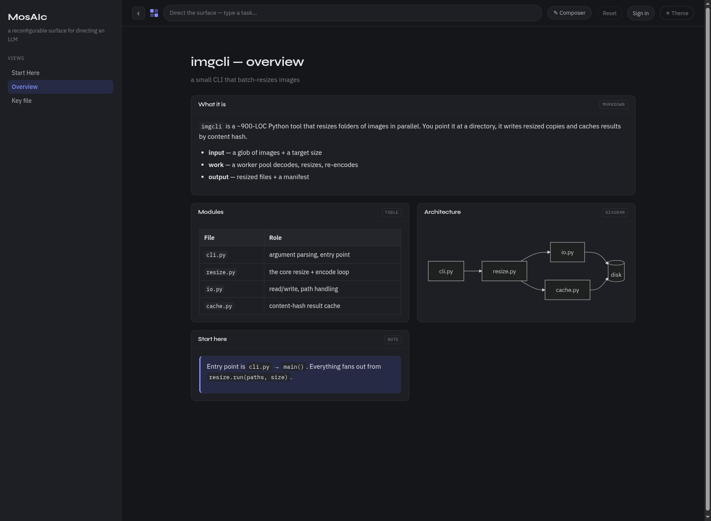

# MosAIc

**A reconfigurable surface for directing an LLM — the panels reshape per task, instead of a linear chat transcript.**

Most LLM interfaces are a scroll: one conversation, no matter the work. MosAIc is a *surface* instead — a sidebar of views and a field of typed tiles. The model emits a small JSON **overlay** describing the shape it wants; MosAIc lays it out. Same mechanism, any task.

It's **bring-your-own-LLM**: sign in with Hugging Face, type a task, and it's sent to a model on [Inference Providers](https://huggingface.co/docs/inference-providers) billed to **your own account** — no backend, no shared key. MosAIc is the surface, not the model.



## Try it

It's a static site — no backend, no build step.

```bash
python3 -m http.server 8000   # then open http://localhost:8000
```

or just open `index.html`.

Three ways to drive it, all from the command bar:

- **Type a task** (signed in) → a model emits an overlay and the whole shell — sidebar *and* tiles — reshapes, on your own HF credits.
- **An example** (`Explain a codebase`, `Debug an error`, `Plan a feature`) → applies a canned overlay instantly, no sign-in.
- **The Composer** → paste/edit overlay JSON and **Apply** it by hand.

The typed/model path needs the OAuth app that the deployed Space provides; running locally, the **examples and Composer** still work, so you can explore the surface with no sign-in.

## How it reshapes

The mechanism is **base + overlay**. A base surface plus an overlay a model emits, merged by view id: `effective(base) = base ⊕ overlay`. The render path reads only from `effective()`, so one overlay reshapes everything. A small validator (`js/overlay.js`) checks every overlay first, so a bad emit degrades to a message instead of breaking the surface.

A **surface** holds **views**; a view lays out **tesserae** — the typed content tiles a mosaic is made of (markdown, code, table, diagram, note, tasks). Controls (the prompt, examples, Composer, theme, sidebar toggle) live in the command bar — chrome the surface can't reshape away. The overlay contract is small and documented in **[SCHEMA.md](SCHEMA.md)** — that's the core IP, the target a model writes to.

## Shape

- `index.html` + `style.css` — the shell, command bar, and aesthetic (Syne + IBM Plex)
- `js/state.js` — `STATE` + `effective(base)`, the base ⊕ overlay merge
- `js/surface.js` — the base surface; `js/demo.js` — the task overlays
- `js/tesserae.js` — one renderer per content tile (adding a type is one function)
- `js/composer.js` — the Composer drawer (a command-bar driver)
- `js/llm.js` — the typed/model path: HF OAuth (viewer token) + Inference Providers
- `js/overlay.js` — validates a model/Composer overlay before it's applied
- `js/view.js`, `js/router.js`, `js/sidebar.js` — the render path
- `js/diagram.js` — diagram tiles via Mermaid (loaded lazily, degrades to source text offline)

See **[CODEMAP.md](CODEMAP.md)** for the file-by-file orientation and **[SCHEMA.md](SCHEMA.md)** for the overlay contract.

## License

MIT.
